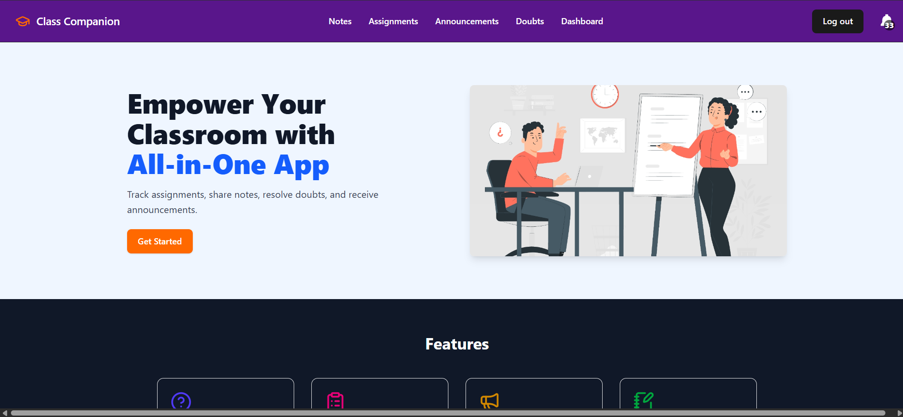
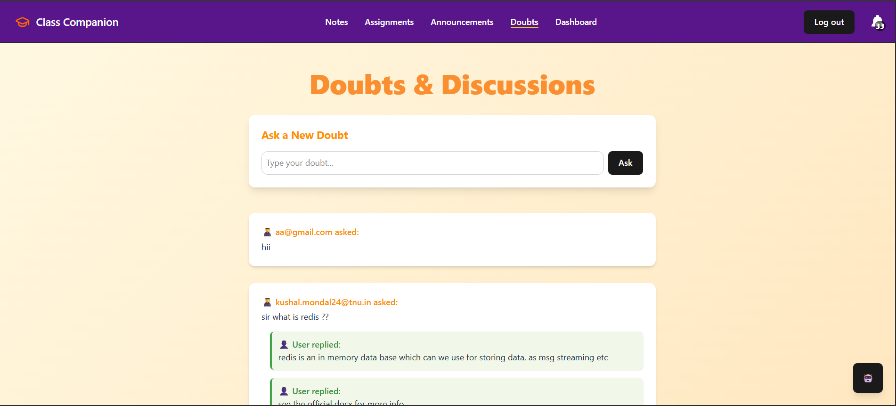
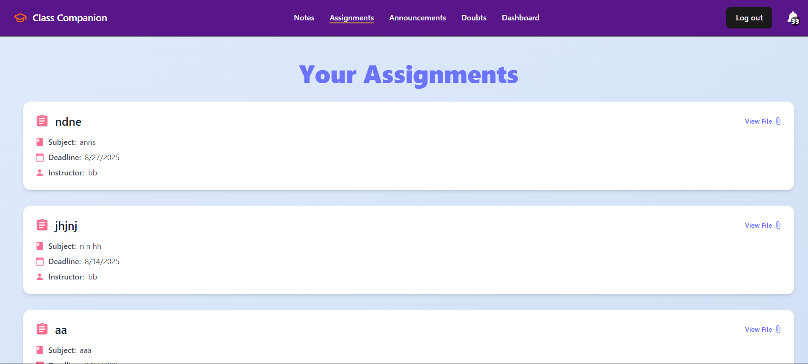
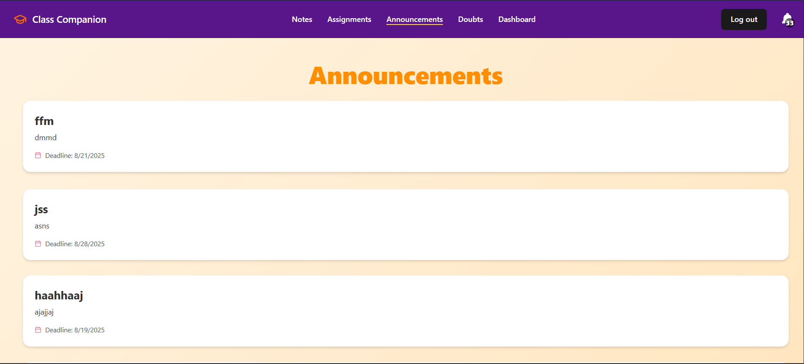
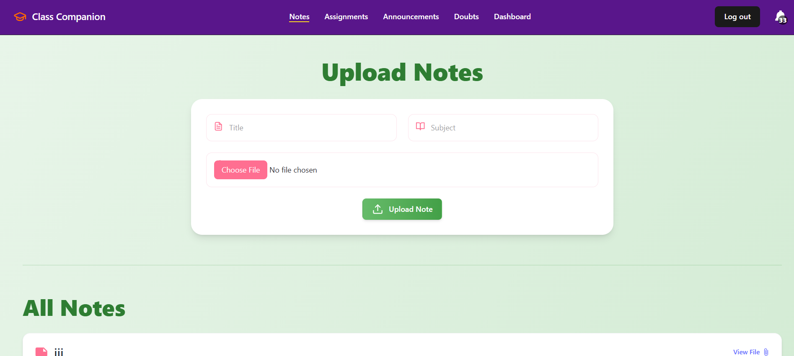

# 📚 Class Companion App

Welcome to **Class Companion**, a web-based application that bridges the gap between students and teachers — making learning more interactive, collaborative, and organized.

---

##  Features

- **📂 Assignments**
  - Upload, manage, and track class assignments with ease.
  
- **❓ Doubts Section**
  - Students can post doubts and receive replies from peers or teachers.<br>
  - Live AI bot assistance for doubt solving.
  
- **💬 Notes**
  - Students can share their notes for collaborative learning.
  
- **📢 Announcements**
  - Teachers can post important updates and notifications to all students.

---

## 🛠️ Tech Stack

- **Frontend:** HTML, CSS, JavaScript (React)
- **Backend:** Node.js, Express
- **Database:** MongoDB
- **Authentication:** JWT-based Auth

---

 <!-- Optional: Add your actual screenshot file path -->
## 📷 Preview

### 🏠 Home Page


### ❓ Doubts Section


### 📝 Assignments Page


### 📝 Announcement Page


### 📝 Notes Page


---

## 💡 How to Run

```bash
# Clone the repository
git clone https://github.com/SH4IKVT/Class-Companion-App
# Navigate into the frontend
cd Class-Companion-App/frontend

# Install dependencies
npm install

# Start the frontend
npm run dev

# In a new terminal, start the backend
cd ../backend
npm install
npm run start

